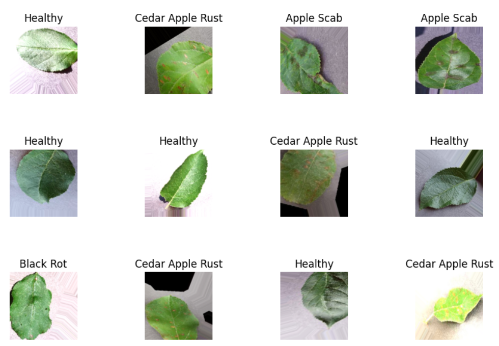
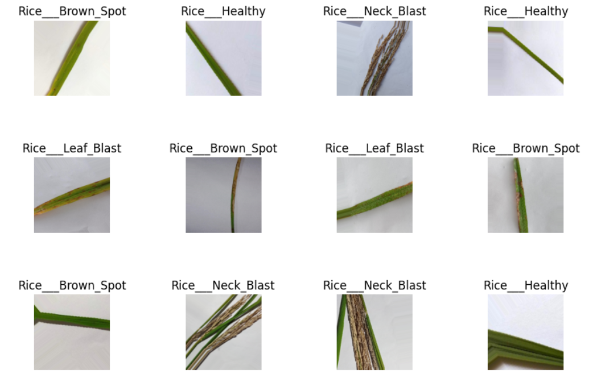
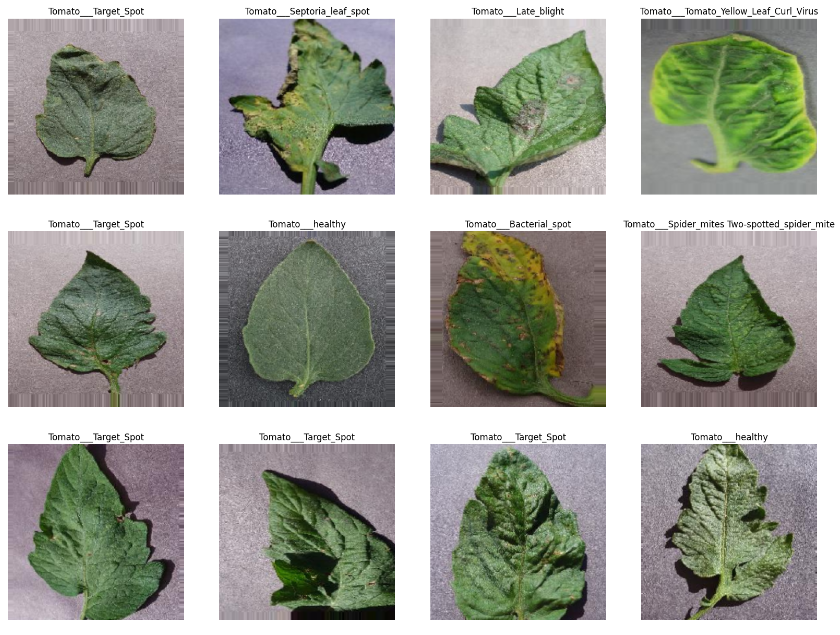
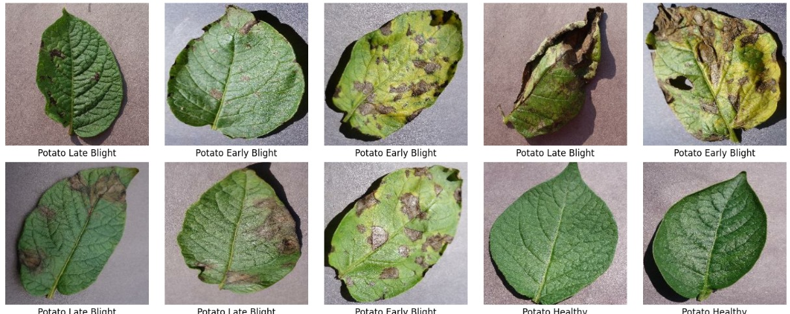
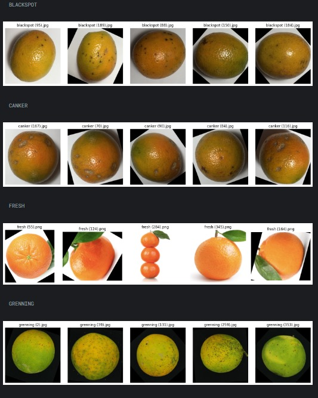

<h1>Agronect Capstone Project - Machine Learning</h1>

### Team ID : C241-PS501
### Team Members
* Sarah Suwarno – Universitas Indonesia – (ML) M010D4KX3022
* Andhika Rhaifahrizal Hartono – Universitas Dian Nuswantoro – (ML) M007D4KY2878
* Faizal Ilyas Syah Putra – Universitas Gajah Mada – (ML) M008D4KY3112
* Bagus Syafiq Faqihuddin – Universitas Jenderal Soedirman – (CC) C229D4KY1116
* Rawiansyah Andhika Suarnanusa – Universitas Pembangunan Nasional "Veteran" Yogyakarta – (CC) C297D4KY0696
* Benedictus Irvanda Nugroho – Universitas Pembangunan Nasional "Veteran" Yogyakarta – (MD) A297D4KY3818
* Muhammad Rizky – Universitas Pembangunan Nasional "Veteran" Yogyakarta – (MD) A297D4KY3817

### Agronect - Machine Learning
This document provides the overview of the machine learning part of our Bangkit Academy 2024's capstone project

**Machine Learning**

Our Machine Learning team contribute in building eight (8) machine learning models that able to classify plant diseases based on characteristics from their leaves or the fruit itself. Consisting of [Apple](https://github.com/agronect-team/bangkit-machine-learning/tree/main/Apel), [Cassava](https://github.com/agronect-team/bangkit-machine-learning/tree/main/Cassava_Disease), [Rice](https://github.com/agronect-team/bangkit-machine-learning/tree/main/Rice_Disease%20fix), [Tomato](https://github.com/agronect-team/bangkit-machine-learning/tree/main/Tomat_Disease), [Banana](https://github.com/agronect-team/bangkit-machine-learning/tree/main/banana_disease), [Corn](https://github.com/agronect-team/bangkit-machine-learning/tree/main/corn_disease), [Orange](https://github.com/agronect-team/bangkit-machine-learning/tree/main/orange_disease), and [Potato](https://github.com/agronect-team/bangkit-machine-learning/tree/main/potato_disease) 

**Dataset Links and classes**

* [Apple](https://www.kaggle.com/datasets/rm1000/augmented-apple-disease-detection-dataset)
  * Apple Scab
  * Black Rot
  * Cedar Apple Rust
  * Healthy
* [Cassava](https://dataverse.harvard.edu/dataset.xhtml?persistentId=doi:10.7910/DVN/T4RB0B)
  * Cassava Brown Streak Disease
  * Cassava Mosaic Disease
  * Healthy
* [Rice](https://www.kaggle.com/datasets/nafishamoin/new-bangladeshi-crop-disease)
  * Healthy
  * Late Blight
  * Leaf Blast
  * Neck Blast
* [Tomato](https://www.kaggle.com/datasets/kaustubhb999/tomatoleaf/data)
  * Tomato Mosaic Virus
  * Target Spot
  * Bacterial Spot
  * Tomato Yellow Leaf Curl Virus
  * Late Blight
  * Leaf Mold
  * Early Blight
  * Spider mites-Two spotted spider mite
  * Healthy
  * Septoria leaf spot
* [Banana](https://www.kaggle.com/datasets/shifatearman/bananalsd)
  * Cordana
  * Healthy
  * Pestaliopsis
  * Sigatoka
* [Corn](https://www.kaggle.com/datasets/nafishamoin/new-bangladeshi-crop-disease)
  * Corn Common Rust
  * Corn Gray Leaf Spot
  * Corn Northern Leaf Blight
  * Corn Healthy
* [Orange](https://www.kaggle.com/datasets/jonathansilva2020/orange-diseases-dataset)
  * Blackspot
  * Cancer
  * Fresh
  * Greening
* [Potato](https://www.kaggle.com/datasets/nafishamoin/new-bangladeshi-crop-disease)
  * Early Blight
  * Late Blight
  * Healthy

**Image Examples**
 

Apple Leaf Diseases Preview Dataset: 

</img>

Rice Leaf Diseases Preview Dataset: 

</img>
 

Tomato Diseases Preview Dataset: 

</img>
 

Banana Leaf Diseases Preview Dataset: 

</img>

Corn Leaf Diseases Preview Dataset: 

</img>

Potato Leaf Diseases Preview Dataset: 

</img>

Orange Diseases Preview Dataset: 

</img>

Banana Leaf Diseases Preview Dataset: 

</img>

Cassava Leaf Diseases Preview Dataset: 

</img>

